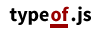

<a id="project-desc-top"></a>

___
__Fix for "typeof" operator [inconsistencies](https://developer.mozilla.org/en-US/docs/Web/JavaScript/Reference/Operators/typeof) / [problems](http://javascript.crockford.com/remedial.html) in JavaScript.__ 
__AMD / CommonJS / Browser compatible.__

To support this project, you can at [the support page](http://richard-kng.github.io/support/) by supporting the developer.
Index
-----

 * [Getting Started](#getting-started-)
 * [API & Usage](#api--usage-)
 * [Suggestions, Requests & Ideas](#suggestions-requests--ideas-)
 * [Issues / Bugs](#issues--bugs-)
 * [Support](#support-)
 * [Contribution & A Note](#contribution--a-note-)
 * [License](#license-)

Getting Started [&#9652;](#index)
---------------

__NPM__ ([What is NPM?](https://docs.nodejitsu.com/articles/getting-started/npm/what-is-npm) [What is Grunt?](http://gruntjs.com/))

    npm install typeof.js

__Bower__ ([What is Bower?](http://bower.io/))

    bower install typeof.js

__Download directly__ __(Do not link this directly on your site, the file is sent with a plain/text header and can cause loading problems)__

- [typeof.js](https://raw.githubusercontent.com/richard-kng/typeof.js/master/lib/typeof.js)

API & Usage [&#9652;](#index)
-----------

Suggestions, Requests & Ideas [&#9652;](#index)
-----------------------------
Post any occurring suggestions, useful ideas and requests to the project's issue page under the __suggestion/idea/request__ label by clicking [here](https://github.com/richard-kng/typeof.js/labels/suggestion/idea/request).

 - Constructive criticism is encouraged and welcomed by contacting the developer or using GitHub.

Issues / Bugs [&#9652;](#index)
-------------
In case of any occurring issues and/or bugs, post on the project's [issues](https://github.com/richard-kng/typeof.js/issues) page with appropriate label(s).

Support [&#9652;](#index)
-------
If you find this tool useful, you can support this project by supporting the developer [here](http://richard-kng.github.io/support/).

Contribution & A Note [&#9652;](#index)
---------------------
In the spirit of open source software development, this project is always open to and encourages community code contribution. To get started, just run through the source file, check the comments and general coding style and start to contribute.

- In case you find this tool useful, [support it](http://richard-kng.github.io/support/) by supporting the developer, follow the developer on [social platforms](http://richard-kng.github.io/support/#social) or send an email to the developer.

License [&#9652;](#index)
-------
Copyright (c) 2014 "Richard KnG" Richárd Szakács. __Licensed under the MIT license__.

The license mentioned above applies to all parts of this software except as
documented below

All files located in the node_modules, external directories and other directories are
externally maintained libraries used by this software which have their
own licenses. We recommend you read them, as their terms may differ from
the terms above.
